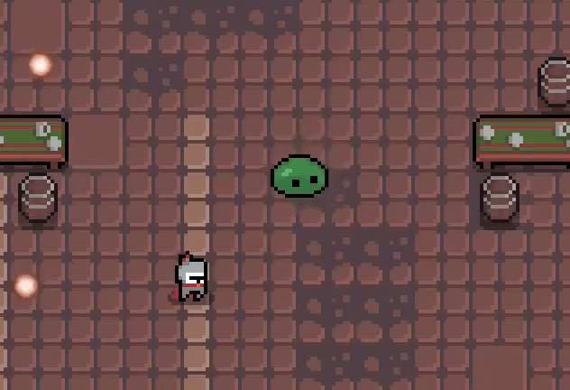
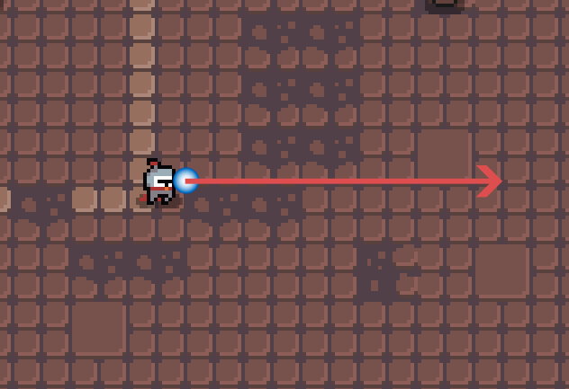
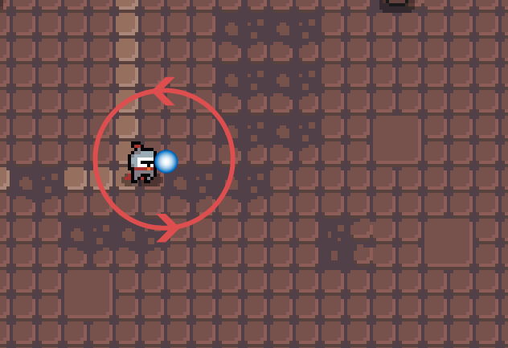
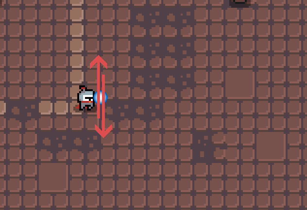

# 2D Projectiles plugin for Godot 4

More materials, e.g. demo project can be found in .

## Overview

This addon provides the functionallity for simple 2D bullets/projectiles system, similar to ones seen in games such as Enter the Gungeon, The Textorcist, or other "lighter" bullethell games. Bullet patterns can be created/modified with dedicated editor.



## Installation

To add this plugin to your Godot 4 project:
* copy the folder **./addons/projectiles_plugin/** into your project's **addons/** folder (create it if it's not there)
* enable the plugin in **Project**->**Project settings...**->**Plugins** menu Godot

If you've added it correctly, new editor view called **Projectiles Editor** should be available in the bottom dock.

## Limitations

This project has been created with fast prototyping and ease of game content creation/modification as a top priority. The performance may be luckluster for more demanding applications.

## Functionality

The following types of objects are defined in this addon:
* **Projectile:** bullet travelling in 2D space; can hit objects.
* **Trajectory:** path, along which the *Projectile* is moving.
* **Pattern:** defines all of the *Projectiles* that are fired at the same time, e.g. shotgun-like patter may contain 5 bullets at angles -40, -20, 0, 20 and 40.
* **Pattern Element:** a sort of "spawner" for single bullet inside a given pattern.
* **Pattern Shooter:** object that can fire an assigned *Pattern*.

### Trajectories

The following basic trajectories are defined:
* **LinearTrajectory2D**: projectiles travel in straight line:


* **CircularTrajectory2D**: projectiles orbit around a point:


* **ZigzagTrajectory2D**: projectiles oscillate around a point:



The **CombinedTrajectory2D** makes it possible to move projectile along two or more trajectories at once. For example, the sinusoidal path can be constructed by combining **LinearTrajectory2D** and **ZigzagTrajectory2D**:


# +

# =


New user-defined trajectories can be created by inheriting **Trajectory2D** class and providing ```get_delta(delta: float, total_time: float) -> Vector2:``` function. This function should return the 2D displacement between trajectory position in time ```total_time``` and ```total_time + delta```.

### Projectiles

Projectiles can hit objects. By default the bulles look for ```damage(dmg: float) -> void:``` function in objects they hit and invoke it. After hitting anything, the projectile is freed, regardless of whether the target has ```damage()``` method or not.

The custom behaviour can be achieved by inheriting **Projectile2D** and providing ```_on_body_entered(body: Node2D) -> void:``` function.

**Projectile2D** class exposes the following signals:
* ```body_hit(projectile: Projectile2D, body: Node2D)``` - emitted whenever a projectile hits something.
* ```max_range_reached(projectile: Projectile2D)``` - emitted when a projectile reaches it's assigned range and is about to be freed.

### Pattern Elements

Projectiles are spawned on **PatternElement2D**s and have their properties defined by them. Each element can create only one bullet when firing a pattern, but two or more elements can be placed on the same ```position```.

The following properties of projectiles can be controlled by **PatternElement2D**s:

| Property | Description |
|---|---|
| ```projectile``` | **Projectile2D** scene that is spawned by element |
| ```position``` | Determines where the projectile is spawned |
| ```angle``` | Direction, at which the bullet is fired |
| ```trajectory``` | Path, along which the projectile travels |
| ```speed``` | How fast the bullet travels |
| ```speed_ramp``` | How the speed of the bullet changes as it travels. If ```speed_ramp``` is set, it takes precedence over ```speed``` setting. The ramp should be defined for [0, ```range```] on X axis. |
| ```range``` | How far the bullet will travel |
| ```spawn_delay``` | Time, after which the bullet will be spawned |
| ```travel_delay``` | After the bullet is spawned, ```travel_delay``` will define how long it will take for the bullet to start moving. |
| ```rand_spread``` | How much the ```angle``` will be randomized when firing the bullet |
| ```target_group``` | When defined, the bullet will be fired in the direction of the closest object from specified group |


### Pattern Shooters

```position``` and ```rotation``` of this node influence the origin where the pattern is fired and directions of projectiles.

Two *Pattern Shooters* are available:
* **PatternShooter2D** - simply fires a given pattern.
* **TargetedShooter2D** - automatically rotates in the direction of the closest node from group specified by ```group_name``` parameter.

Two signals are available for *Pattern Shooters*:
* ```new_projectile_fired(projectile: Projectile2D)``` - emitted after each projectile is fired.
* ```all_fired()``` - emitted after all of the projectiles in assigned **Pattern2D** have been fired.

**Note:** if a given pattern uses ```spawn_delay```, signal ```all_fired``` will be emitted only after the last projectile has been spawned (after time = max ```spawn_delay``` from all of the **PatternElement2D**s).

### Editor

The **Projectiles Editor** is located in the Godot Editor's bottom dock. It should automatically open when **Pattern2D** resource is selected in the Inspector.

For most actions, keyboard shortcuts are available. Keybindings can be changed by editing ```keybindings``` in */addons/projecitles_plugin/projectiles_plugin.gd*. The default actions are as follows:

| Action name | Default shortcut | Description
|---|---|---|
| ```move_elem``` | ```A``` | Move an element around |
| ```rotate_elem``` | ```S``` | Rotate element |
| ```duplicate_elem``` | ```D``` | Duplicate selected elements |
| ```select_all``` | ```F``` | Select all of the elements |
| ```toggle_snapping``` | ```Z``` | Turn snapping to grid ON/OFF |
| ```test_pattern``` | ```X``` | Visualize the pattern in the editor, the same way it will look when fired in a game |
| ```remove_elems``` | ```Delete``` | Deletes selected elements |
| ```modify_s_delay``` | ```Q``` | Turns on ```spawn_delay``` modification. After using this shortcut, use mouse wheel to adjust the value. Hold Alt or Shift to adjust how fast the value is changing. |
| ```modify_t_delay``` | ```W``` | Turns on ```travel_delay``` modification. After using this shortcut, use mouse wheel to adjust the value. Hold Alt or Shift to adjust how fast the value is changing. |
| ```modify_speed``` | ```E``` | Turns on ```speed``` modification. After using this shortcut, use mouse wheel to adjust the value. Hold Alt or Shift to adjust how fast the value is changing. |
| ```modify_range``` | ```R``` | Turns on ```range``` modification. After using this shortcut, use mouse wheel to adjust the value. Hold Alt or Shift to adjust how fast the value is changing. |
| ```rotate_parallel``` | ```1``` | Rotates selected elements to point into mouse direction, in a way that keeps those directions parallel to each other |
| ```rotate_focused``` | ```2``` | Rotates selected elements, so that each of them points into mouse directly |
| ```rotate_inwards``` | ```3``` | Rotates selected elements to point into the origin of edited pattern |
| ```rotate_outwards``` | ```4``` | Rotates selected elements to point in the opposite direction to the origin of edited pattern |
| ```rotate_random"``` | ```5``` | Rotates selected elements by random value  |

Additionally, the view can be moved around by holding Middle Mouse Button (scroll wheel). 

The view can be zoomed in/out by holding Ctrl and using scroll wheel.

## Future work

* Move some/all functionality of projectiles handling (not editor and it's features) to GDNative extension/C++ compiled code for improved performance.
* Undo/redo support.